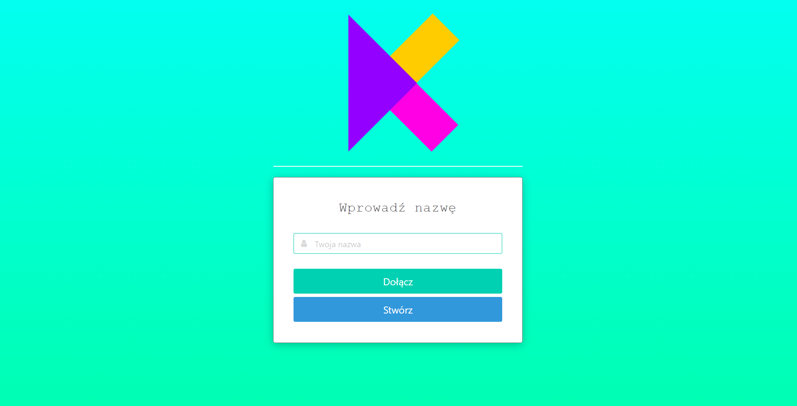
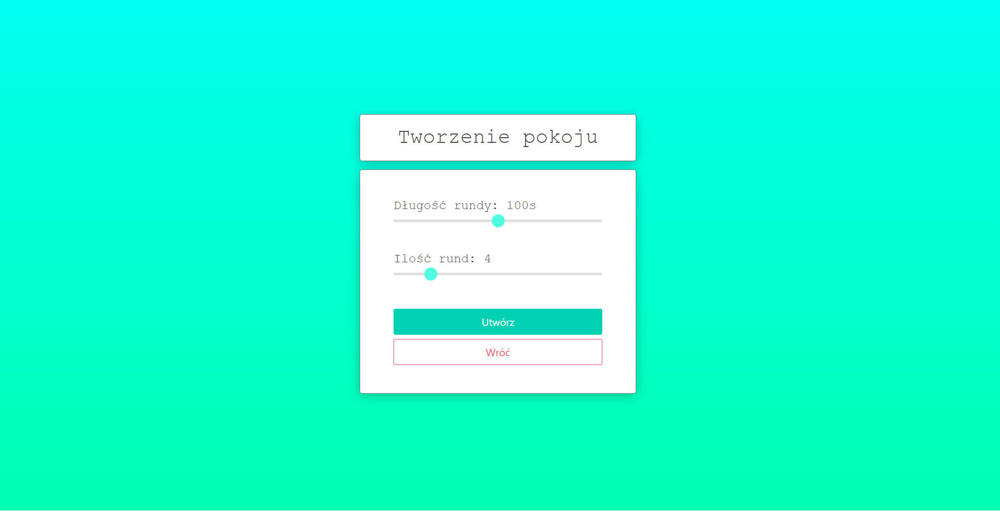
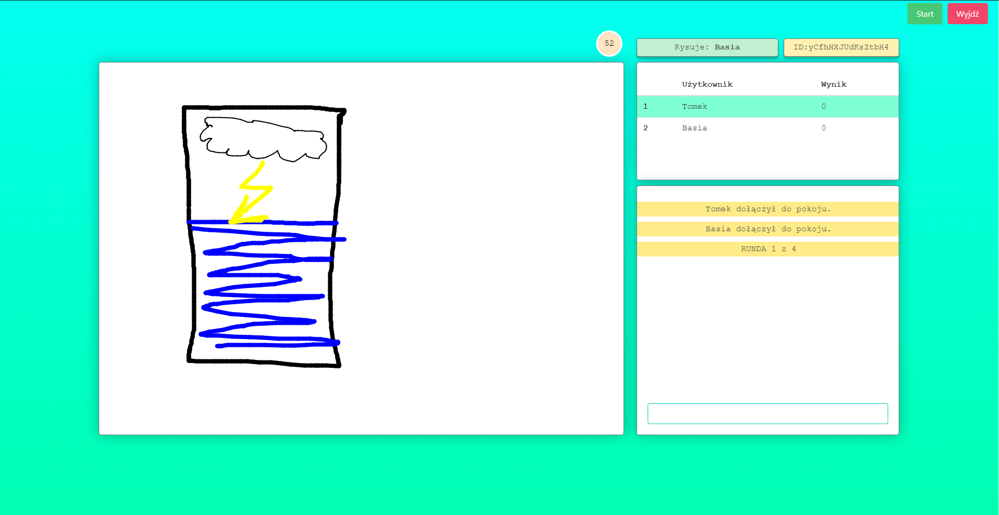
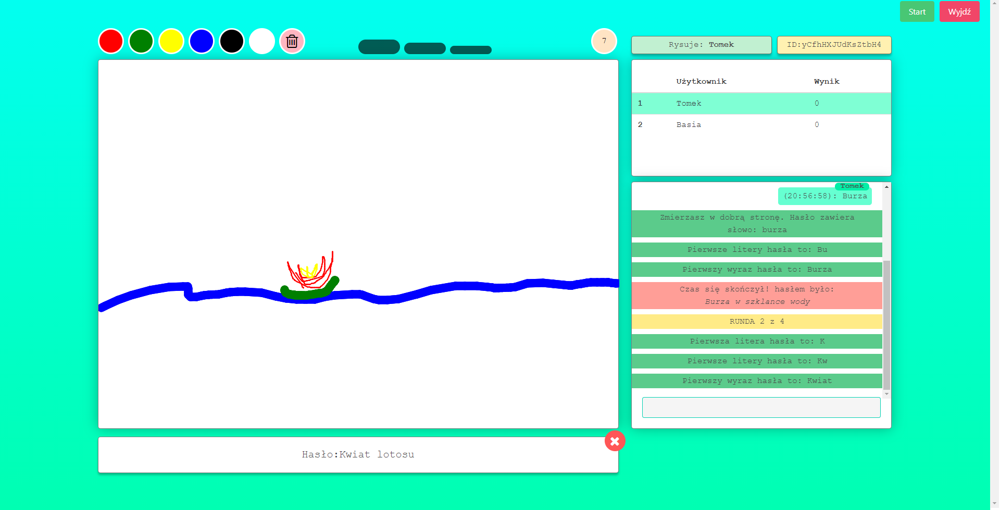

# Kalamburko
Gra przeglądarkowa online typu kalambury.


[](https://flask.palletsprojects.com/en/2.0.x/)

## Technologie
Projekt wykonany przy użyciu:
* Python 3
* Flask 1.1.2
* SQLite 3
* Bulma
* Socket.IO

## Zrzuty z gry

<h4>Ekran powitalny:</h4>
<p>
  
</p>

<h4>Ekran tworzenia pokoju:</h4>
<p>
  
</p>

<h4>zrzuty z rozgrywki:</h4>
<p>
  
  
</p>


## Uruchomienie
* Sklonuj to repozytorium:
```sh
git clone https://github.com/MiiiZawadzki/Projekt-Kalambury.git
```
* Zainstaluj wymagane pakiety:
```sh
pip install -r requirements.txt
```
* Uruchom projekt:
```sh
python main.py
```
* Przejdź pod adres: `http://127.0.0.1:5000/`.

